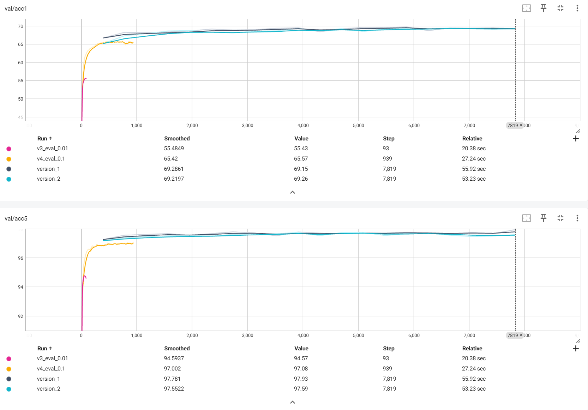

# 📌 SimCLR Project

## 🔍 Introduction
This project implements **SimCLR** for self-supervised learning using contrastive loss in order to learn representations for images. The model is based on **ResNet-18** and **ResNet-50** architecture and is implemented using **PyTorch Lightning** for efficient training and experimentation.

## 📂 Dataset
- **Dataset:** The dataset used in this project is **CIFAR-10**, which consists of 60,000 32x32 color images in 10 classes.
- **Preprocessing:**
  - Images are resized to 224x224 before being fed into the ResNet model.
  - Normalization is performed using the ImageNet mean and standard deviation.

## 🖼️ Augmented Example
Here is an example of the output image:


## 🏗️ Pipeline
1. **Self-supervised Learning (SimCLR):**
   - The model uses contrastive loss to learn embeddings of images without labeled data.
   - The ResNet-18 or ResNet-50 architecture, pretrained on ImageNet, is fine-tuned on CIFAR-10 for the representation learning task.
2. **Training:**
   - The model is trained with **PyTorch Lightning** for ease of experimentation and distributed training support.
   - The loss function used is **contrastive loss** with an **NT-Xent** loss function for the contrastive task.
   - **Optimizer:** Adam optimizer is used for training the model.

## ⚙️ Model & Training
- **Backbone:** ResNet-18 or ResNet-50 (pretrained on ImageNet, fine-tuned on CIFAR-10)
- **Loss Function:** Contrastive loss (NT-Xent loss)
- **Optimizer:** Adam
- **Evaluation Metric:** Top-1 accuracy, Top-5 accuracy
- **Training Results:**
  - **Train Loss:** 1.3 - 2.0
  - **Train Accuracy Top-1:** ~70%
  - **Train Accuracy Top-5:** ~96%
  - **Validation Accuracy Top-1:** ~70%
  - **Validation Accuracy Top-5:** ~96%

## 📌 Performance
| Metric                | Value            |
|-----------------------|------------------|
| Train Loss            | 1.3 - 2.0        |
| Train Accuracy Top-1  | ~70%             |
| Train Accuracy Top-5  | ~96%             |
| Validation Accuracy Top-1 | ~70%         |
| Validation Accuracy Top-5 | ~96%         |

### Train set


### Val set


## 🚀 How to Run
### Install Dependencies
```bash
pip install -r lightning 
```

### Get some augmented imgs
```bash
python get_auged_pic.py 
```
### Training and Evaluating
```bash
python main5.py --batch_size 256 --epochs 100 --lr 1e-3 --tau 0.07 --eval_epochs 50 
```

### Only Evaluation (frac means label fraction)
```bash
python main5.py --only_eval --frac 0.1
```

## 🔬 Observations
- **Result**: It seems to be good.

## 🔮 Future Improvements
- **Batch size - related problem:** In the original paper, it confirmed that the bigger batch size, the more accuracy simply because the aug pictures are able to learn with more negative pairs. However, in the above model, it is not, may be about the hyper parameters.

---
📌 **Developed as part of a deep learning project for contrastive learning.**

